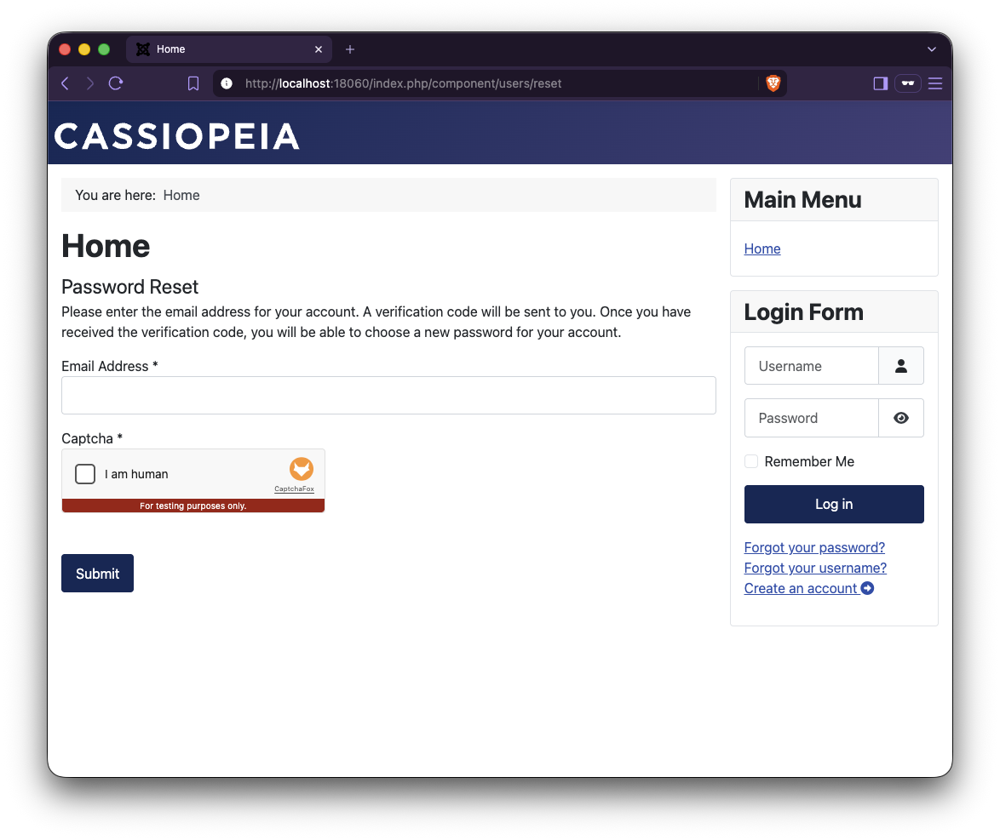

# CaptchaFox for Joomla

Official [CaptchaFox](https://captchafox.com) captcha plugin for Joomla. It protects Joomla's forms
against bots with CaptchaFox, a privacy-friendly captcha service.

<p align="center">
  
</p>

> **Status:** in development, no release yet.

## Compatibility

| Joomla | PHP |
|---|---|
| 5.4 or later | 8.1 or later |
| 6.x | 8.3 or later |

Joomla 3, 4, 5.0–5.3 and 7 are not supported. The installer rejects unsupported versions.

## Protected forms

The plugin works through Joomla's captcha interface, so it protects every form that uses Joomla's
captcha field. In Joomla itself these are:

- contact form
- user registration
- "Forgot your username?"
- "Forgot your password?"
- article submission in the frontend

Form extensions that bring their own captcha integration (for example form builders) are not covered.

## Installation and setup

### 1. Install the plugin

Download `plg_captcha_captchafox-<version>.zip` from the
[releases](https://github.com/CaptchaFox/captchafox-joomla/releases). In the Joomla administrator, go
to **System → Install → Extensions** and upload the ZIP.

### 2. Get your keys

In the CaptchaFox portal, copy the **site key** of your website (Sites) and the **secret key** of your
organisation (Organization Settings).

### 3. Configure and enable the plugin

Go to **System → Manage → Plugins**, search for "CaptchaFox" and open **Captcha - CaptchaFox**:

1. Enter the **Site Key** and the **Secret Key**.
2. Set **Status** to **Enabled**.
3. Keep **Access** at **Public**. With any other access level, Joomla cannot use the plugin for
   visitors and rejects their forms (see [Troubleshooting](#troubleshooting)).
4. Click **Save & Close**.

### 4. Choose where CaptchaFox is used

CaptchaFox has no switch per form. Joomla decides which captcha a form uses, on two levels.

**Site-wide:** Go to **System → Global Configuration**, tab **Site**, set **Default Captcha** to
"Captcha - CaptchaFox" and save. From then on, all [protected forms](#protected-forms) show CaptchaFox,
as long as the components below keep their default "Use Global".

**Per component (optional):** A component can use a different captcha or none. Open the component,
click **Options** in the toolbar (top right) and change the option:

| Component | Tab | Option | Applies to |
|---|---|---|---|
| Components → Contacts | Form | Allow Captcha on Contact | all contact forms |
| Users → Manage | User Options | Captcha | registration, "Forgot your username?" and "Forgot your password?" together |
| Content → Articles | Editing Layout | Allow Captcha on submit | article submission in the frontend |

Each of these options offers:

- **Use Global:** the Default Captcha from the Global Configuration (the default)
- **None:** no captcha for this component
- a specific captcha plugin, for example "Captcha - CaptchaFox"

Example: Default Captcha "Captcha - CaptchaFox" and Contacts "None" means that every protected form
except the contact forms uses CaptchaFox.

Good to know:

- A single contact or menu item cannot switch the captcha on or off. All contact forms behave the same.
- Joomla's login form has no captcha.
- A form only appears if its feature is on. Registration, for example, needs **Allow User
  Registration** (Users → Manage → Options → User Options).
- The captcha is also shown to logged-in users.
- Forms of other extensions that use Joomla's captcha field show CaptchaFox automatically.

## Options

| Option | Values | Default |
|---|---|---|
| Site Key | from the CaptchaFox portal | – |
| Secret Key | from the CaptchaFox portal, only used on the server | – |
| Mode | Inline, Popup, Hidden | Inline |
| Theme | Light, Dark | Light |
| Start | On click, On form focus, Automatically | On click |
| Language | Language of the site, Language of the browser, Fixed language | Language of the site |
| If CaptchaFox Is Unreachable | Block the form, Let the form through and log it | Block the form |

- **Language of the site** passes the current Joomla language to the widget. Languages that
  CaptchaFox does not offer fall back to the browser language.
- **Hidden** shows no widget. The check runs when the form is submitted, and the plugin shows the
  notice that CaptchaFox requires in this mode ("This site is protected by CaptchaFox …").

## How it works

- **In the browser:** A form is only sent once the widget has been solved. Otherwise a hint appears
  at the widget ("Please confirm that you are human."). Cancelling, for example in the article form,
  is never blocked. In hidden mode the check runs automatically on submit.
- **On the server:** Every answer is verified with CaptchaFox before Joomla processes the form. The
  browser check is only a convenience; the server-side verification decides.
- **If CaptchaFox is unreachable** (network error, timeout of 5 seconds, error response), the option
  "If CaptchaFox Is Unreachable" decides. Answers that CaptchaFox rejects are always rejected.
- **Log:** Outages are written to `plg_captcha_captchafox.php` in Joomla's log folder
  (Global Configuration → Logging → "Path to Log Folder"). Rejected answers are only logged when
  Joomla's debug mode is on. The secret key is never logged.
- **Plugin disabled while still selected:** If CaptchaFox is still selected as captcha but the plugin
  is disabled or its access level is not Public, forms are rejected instead of being accepted without
  a check, and visitors see "Captcha not available".
- **Page cache and Content Security Policy:** The widget markup contains no inline script and no
  session data, so it works with Joomla's page cache and with a nonce-based Content Security Policy.
  For combining both, see [Troubleshooting](#troubleshooting).

## Privacy

CaptchaFox is operated by Scoria Labs GmbH, Germany. How CaptchaFox processes data and how to get a
data processing agreement is described in the [CaptchaFox Privacy Center](https://captchafox.com/privacy).
A suggested paragraph for your privacy policy is on the
[GDPR page](https://captchafox.com/privacy/gdpr).

## Content Security Policy

If your site sends a Content Security Policy, for example with the core plugin
"System - HTTP Headers", allow CaptchaFox in these directives. Keep your existing values such as
`'self'`, which the plugin's own script needs.

| Directive | Add |
|---|---|
| `script-src` | `https://*.captchafox.com blob:` |
| `connect-src` | `https://*.captchafox.com` |
| `style-src` | `https://*.captchafox.com` |
| `img-src` | `https://*.captchafox.com` |
| `media-src` | `https://*.captchafox.com` |

- If you set `worker-src` or `child-src`, add `blob:` there as well. The widget runs a web worker from
  a `blob:` URL.
- With "Nonce" enabled in "System - HTTP Headers", Joomla adds the nonce to the plugin's scripts
  automatically.
- Subresource Integrity (SRI) is not possible: CaptchaFox serves `api.js` from an unversioned URL, and
  the file must be loaded from the CaptchaFox CDN.

## Troubleshooting

### Scripts are blocked on cached pages when a CSP nonce is used

**Symptom:** With "System - Page Cache" and a Content Security Policy with "Nonce" enabled, the
widget or other scripts do not load for some visitors. The browser console reports Content Security
Policy violations.

**Cause:** This is a general Joomla limitation, not specific to CaptchaFox. The page cache stores the
complete page, including the nonce of the visit that filled the cache. Later visitors get a new nonce
in the CSP header, so every script that relies on the nonce alone is blocked.

**CaptchaFox is not affected** as long as your policy allows `https://*.captchafox.com` (see above),
`'self'` is allowed in `script-src`, and "strict-dynamic" is disabled: the browser then accepts these
scripts by their origin. With "strict-dynamic" enabled, the browser ignores origins and relies on the
nonce only.

**Solutions:**

- Exclude pages with forms from the page cache ("System - Page Cache", options "Exclude Menu Items" or
  "Exclude URLs"), or
- do not combine the page cache with a nonce-based policy that uses "strict-dynamic".

### "CaptchaFox is not configured yet"

The site key or the secret key is missing. Enter both in the plugin settings.

### "Captcha not available. This form cannot be sent at the moment."

CaptchaFox is selected as captcha, but Joomla cannot use the plugin: it is disabled, or its access
level is not Public. Enable the plugin and set its access level to Public, or select another captcha.

### "The captcha could not be verified right now"

The server could not reach the CaptchaFox API and the plugin is set to block the form in that case.
Check that the server can open HTTPS connections to `api.captchafox.com`. If your server needs a proxy,
set it in Joomla's Global Configuration (Server → "Enable Outbound Proxy"); the plugin uses it. Details are in
the log file `plg_captcha_captchafox.php`.

### "Please confirm that you are human." although the widget was solved

The confirmation is only valid for a short time. Solve the widget again and send the form.

### Content Security Policy reports inline styles of the widget

Without `'unsafe-inline'` in `style-src`, the browser may report blocked inline style attributes
(`style-src-attr`) of the widget. These reports are harmless; the widget keeps working.

## Development

The installable package is built from `plugin/`, which contains exactly the files that end up in
the ZIP. Requirements: PHP 8.1+ with the `zip` extension and Composer.

```bash
composer build
```

This writes `dist/plg_captcha_captchafox-<version>.zip`. The version is taken from
`plugin/captchafox.xml`.

Without a local PHP installation, the build can run in the official Composer image:

```bash
docker run --rm -v "$PWD":/app -w /app composer:2 composer build
```

Quality checks (after `composer install`):

| Command | Checks |
|---|---|
| `composer test` | Unit tests (PHPUnit) |
| `composer cs` | Code style, the rules of the Joomla core (`composer cs-fix` fixes it) |
| `build/phpstan.sh` | Static analysis (PHPStan level 8, PHP 8.1) against Joomla 5.4 and 6, using the Joomla source in the official Docker images |

The code must stay compatible with PHP 8.1.

## License

Copyright (C) 2026 Scoria Labs GmbH. Licensed under the GNU General Public License version 2 or
later (GPL-2.0-or-later), see [LICENSE](LICENSE).
